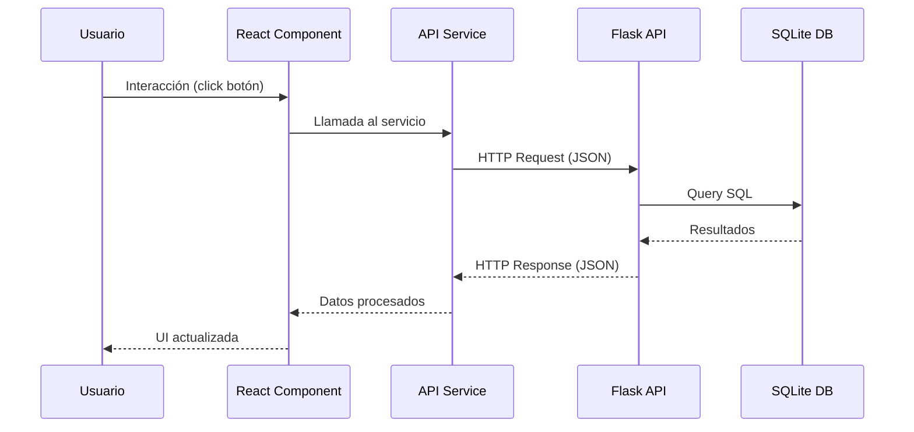

# 🔗 Integración API-Frontend: Eventos Viña

Esta documentación explica **cómo funciona la conexión entre la API Flask de reportes y la aplicación web React/TypeScript**, incluyendo la arquitectura, flujo de datos y detalles técnicos de implementación.

## 📋 Índice

1. [Arquitectura General](#arquitectura-general)
2. [Configuración de la Conexión](#configuración-de-la-conexión)
3. [Flujo de Datos](#flujo-de-datos)
4. [Componentes de la Integración](#componentes-de-la-integración)
5. [Servicios API](#servicios-api)
6. [Manejo de Errores](#manejo-de-errores)
7. [Configuración para Desarrollo](#configuración-para-desarrollo)
8. [Guía de Uso](#guía-de-uso)

---

## 🏗️ Arquitectura General

### Stack Tecnológico
```
Frontend (Puerto 3000)          Backend API (Puerto 5001)
├── React 18 + TypeScript       ├── Flask + Flask-RESTX
├── Vite (Build Tool)            ├── SQLAlchemy (ORM)
├── Tailwind CSS + Radix UI      ├── SQLite Database
└── Fetch API (HTTP Client)     └── CORS habilitado
```

### Comunicación
```
[React App] ←→ [HTTP/JSON] ←→ [Flask API] ←→ [SQLite DB]
```

La comunicación se realiza mediante:
- **Protocolo**: HTTP/HTTPS
- **Formato**: JSON para intercambio de datos
- **Métodos**: GET, POST, DELETE
- **Autenticación**: Sin autenticación (API pública)

---

## ⚙️ Configuración de la Conexión

### 1. Configuración de CORS en la API (Flask)

La API Flask ya tiene CORS configurado para permitir conexiones desde el frontend:

```python
# En app_reportes.py
from flask_cors import CORS

app = Flask(__name__)
CORS(app)  # Permite todas las conexiones cross-origin
```

### 2. Proxy de Desarrollo (Vite)

Para desarrollo local, Vite está configurado para hacer proxy de las peticiones API:

```typescript
// vite.config.ts
export default defineConfig({
  server: {
    port: 3000,
    proxy: {
      '/api': {
        target: 'http://localhost:5001',
        changeOrigin: true,
        rewrite: (path) => path.replace(/^\/api/, '')
      }
    }
  }
});
```

**¿Por qué usar proxy?**
- Evita problemas de CORS en desarrollo
- Simplifica las URLs (usa `/api` en lugar de `http://localhost:5001`)
- Mantiene consistencia entre desarrollo y producción

### 3. Configuración del Cliente API

```typescript
// src/services/apiClient.ts
const isDevelopment = window.location.hostname === 'localhost';
const API_BASE_URL = isDevelopment ? '/api' : 'http://localhost:5001';
```

---

## 🔄 Flujo de Datos

### Flujo Típico de una Operación



### Ejemplo Específico: Agregar Evento

1. **Usuario** hace click en "Agregar Evento"
2. **Componente React** llama a `eventosService.agregarEvento()`
3. **Servicio API** hace `POST /eventos/add` con datos JSON
4. **Flask API** valida los datos con `reqparse`
5. **SQLAlchemy** inserta en tabla `eventos_log`
6. **API** retorna confirmación JSON
7. **Frontend** actualiza la lista de eventos
8. **Usuario** ve el evento agregado en tiempo real

---

## 🧩 Componentes de la Integración

### 1. Servicio API Cliente (`src/services/apiClient.ts`)

**Propósito**: Abstrae toda la comunicación HTTP con la API

```typescript
// Tipos TypeScript para type safety
export interface EventoRequest {
  evento_id: number;
  nombre: string;
  fecha: string; // YYYY-MM-DD
  hora: string;  // HH:MM:SS
  ubicacion: string;
}

// Servicio de eventos
export const eventosService = {
  async agregarEvento(evento: EventoRequest): Promise<ApiResponse<EventoLog>> {
    return fetchAPI<ApiResponse<EventoLog>>('/eventos/add', {
      method: 'POST',
      body: JSON.stringify(evento),
    });
  }
}
```

**Características**:
- ✅ **Type Safety**: Tipos TypeScript para todas las interfaces
- ✅ **Error Handling**: Manejo centralizado de errores
- ✅ **Logging**: Console logs para debugging
- ✅ **Abstracción**: Oculta complejidad HTTP del componente

### 2. Componente de Gestión (`src/components/EventManagement.tsx`)

**Propósito**: Interfaz para agregar, eliminar y listar eventos

```typescript
const handleAddEvent = async (e: React.FormEvent) => {
  try {
    const response = await eventosService.agregarEvento(formData);
    if (response.success) {
      setSuccess(`✅ Evento "${formData.nombre}" agregado exitosamente`);
      await loadLogs(); // Recargar lista
    }
  } catch (err) {
    setError(`❌ Error: ${err.message}`);
  }
};
```

**Características**:
- 🔄 **Estado en tiempo real**: Actualiza lista automáticamente
- ⚡ **Validación**: Validación de formularios en tiempo real
- 🌐 **Conexión API**: Indicador visual del estado de conexión
- 📱 **Responsive**: Adaptable a móviles y desktop

### 3. Componente de Reportes (`src/components/Reports.tsx`)

**Propósito**: Visualización y descarga de reportes de ventas

```typescript
const handleDownloadPDF = async () => {
  try {
    const blob = await reportesService.descargarReportePDF(filtros);
    const fileName = `reporte_${new Date().toISOString().split('T')[0]}.pdf`;
    descargarArchivo(blob, fileName);
  } catch (err) {
    setError(`❌ Error descargando PDF: ${err.message}`);
  }
};
```

**Características**:
- 📊 **Visualización**: Dashboards con métricas de ventas
- 📁 **Descarga**: PDF y Excel desde el navegador
- 🔍 **Filtros**: Búsqueda por evento, fecha, sector
- 💰 **Análisis**: Resumen ejecutivo y análisis por sector

---

## 🛠️ Servicios API

### eventosService

| Método | Endpoint | Descripción |
|--------|----------|-------------|
| `agregarEvento()` | `POST /eventos/add` | Agrega un evento al log |
| `eliminarEvento()` | `DELETE /eventos/delete` | Elimina un evento |
| `obtenerLogs()` | `GET /eventos/logs` | Lista todos los logs |

### reportesService

| Método | Endpoint | Descripción |
|--------|----------|-------------|
| `obtenerReporteVentas()` | `GET /reportes/ventas` | Obtiene reporte JSON |
| `descargarReportePDF()` | `GET /reportes/ventas?formato=pdf` | Descarga PDF |
| `descargarReporteExcel()` | `GET /reportes/ventas?formato=excel` | Descarga Excel |

### Ejemplo de Request/Response

**Request (Agregar Evento)**:
```json
POST /eventos/add
{
  "evento_id": 123,
  "nombre": "Concierto Rock",
  "fecha": "2024-12-25",
  "hora": "20:00:00",
  "ubicacion": "Estadio Nacional"
}
```

**Response**:
```json
{
  "success": true,
  "message": "Evento agregado exitosamente",
  "evento": {
    "id": 1,
    "evento_id": 123,
    "nombre": "Concierto Rock",
    "fecha": "2024-12-25",
    "hora": "20:00:00",
    "ubicacion": "Estadio Nacional",
    "tipo_operacion": "add",
    "fecha_operacion": "2024-10-11T15:30:00"
  }
}
```

---

## ⚠️ Manejo de Errores

### Estrategia de Error Handling

1. **Errores de Conexión**
```typescript
// Detecta si la API está disponible
const isConnected = await verificarConexionAPI();
if (!isConnected) {
  setError('❌ API no disponible. Verifica que esté funcionando en puerto 5001');
}
```

2. **Errores HTTP**
```typescript
if (!response.ok) {
  throw new Error(`HTTP ${response.status}: ${errorText}`);
}
```

3. **Errores de Validación**
```typescript
// Validación en el frontend
if (!formData.nombre.trim()) {
  setError('El nombre del evento es requerido');
  return;
}
```

4. **Feedback Visual**
```typescript
// Estados de UI
const [loading, setLoading] = useState(false);
const [error, setError] = useState<string | null>(null);
const [success, setSuccess] = useState<string | null>(null);
```

---

## 🔧 Configuración para Desarrollo

### Requisitos Previos

1. **API funcionando**:
```bash
# Terminal 1: Ejecutar API
cd REPORTESPRINT2
python app_reportes.py
# API disponible en http://localhost:5001
```

2. **Frontend funcionando**:
```bash
# Terminal 2: Ejecutar Frontend
cd REPORTESPRINT2
npm run dev
# Frontend disponible en http://localhost:3000
```

### Verificación de Conexión

1. **Swagger UI**: http://localhost:5001/docs/
2. **Test endpoint**: http://localhost:5001/eventos/logs
3. **Frontend**: http://localhost:3000 (debería mostrar estado de conexión)

### Debugging

**Logs en el Frontend**:
```typescript
console.log(`🌐 Haciendo petición ${method} a: ${url}`);
console.log(`✅ Respuesta exitosa de ${endpoint}:`, data);
```

**Logs en la API**:
```python
# Flask automáticamente loguea requests
# 127.0.0.1 - - [11/Oct/2024 15:30:00] "POST /eventos/add HTTP/1.1" 201 -
```

---

## 📖 Guía de Uso

### Para Desarrolladores

1. **Agregar un nuevo endpoint**:
   - Crear endpoint en Flask (`app_reportes.py`)
   - Agregar tipos TypeScript (`apiClient.ts`)
   - Crear función de servicio (`apiClient.ts`)
   - Usar en componente React

2. **Agregar un nuevo componente**:
   - Crear componente en `src/components/`
   - Importar servicios necesarios
   - Agregar a `App.tsx` y navegación

### Para Usuarios Finales

1. **Gestión de Eventos**:
   - Ir a "Gestión" en el header
   - Llenar formulario para agregar eventos
   - Ver lista de eventos en tiempo real
   - Eliminar eventos con un click

2. **Reportes de Ventas**:
   - Ir a "Reportes" en el header
   - Aplicar filtros opcionales
   - Ver dashboard con métricas
   - Descargar PDF o Excel

---

## 🚀 Características Técnicas Avanzadas

### Type Safety
- Interfaces TypeScript para todos los datos
- Validación en tiempo de compilación
- IntelliSense en el editor

### Performance
- Proxy Vite para desarrollo rápido
- Lazy loading de componentes
- Estados de loading optimizados

### UX/UI
- Indicadores de estado de conexión
- Feedback visual inmediato
- Responsive design
- Error handling user-friendly

### Escalabilidad
- Arquitectura modular
- Separación de responsabilidades
- Fácil adición de nuevos endpoints
- Configuración por ambiente

---

## ⚡ Comandos Útiles

```bash
# Verificar API
curl http://localhost:5001/eventos/logs

# Agregar evento via API
curl -X POST http://localhost:5001/eventos/add \
  -H "Content-Type: application/json" \
  -d '{"evento_id":1,"nombre":"Test","fecha":"2024-12-25","hora":"20:00:00","ubicacion":"Test"}'

# Verificar frontend
curl http://localhost:3000

# Build para producción
npm run build
```

---

## 📞 Soporte

Si encuentras problemas:

1. **Verificar puertos**: API en 5001, Frontend en 3000
2. **Revisar logs**: Console del navegador y terminal de Python
3. **Estado de conexión**: El frontend muestra indicador visual
4. **CORS**: Verificar que Flask-CORS esté instalado
5. **Proxy**: Verificar configuración en `vite.config.ts`

---

> **✅ Integración Completa**: La API Flask y la aplicación React están completamente integradas y funcionando. Los usuarios pueden gestionar eventos y generar reportes desde la interfaz web, con datos sincronizados en tiempo real.